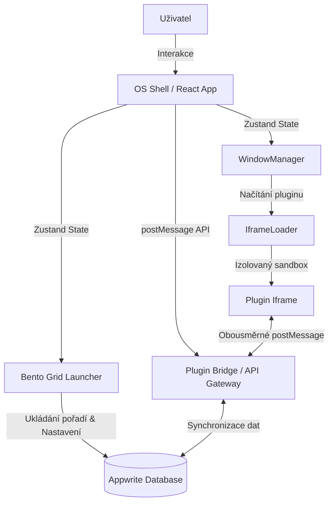

# ARCHITECTURE.md — Systémová architektura Canvas OS

> **Aktualizováno**: 2026-05-19
> **Verze**: v1.0-alpha (Po dokončení Fáze 2)
> **Jazyk**: Čeština

Tento dokument detailně popisuje softwarovou architekturu, komponenty a datové toky v projektu **propoj.app — Canvas OS**.

---

## 1. Celkový přehled systému

Canvas OS je navržen jako modulární webový operační systém, kde jádro (Shell) spravuje uživatelské rozhraní, správu oken a životní cyklus aplikací, zatímco jednotlivé funkční celky a externí doplňky běží jako izolované **Pluginy** v zabezpečených iframech.



---

## 2. Klíčové vrstvy a komponenty

### A. OS Jádro & Layout (`src/shell/`)
Jádro systému koordinuje vykreslování rozhraní a reaguje na globální klávesové zkratky a události.
- **[Shell.tsx](file:///home/jakub/github/propoj-app/src/shell/Shell.tsx)**: Hlavní kontejner, který inicializuje a uspořádává `BentoLauncher`, `WindowManager` a `Taskbar`. Zároveň registruje globální listener pro `postMessage` komunikaci.
- **[Desktop.tsx](file:///home/jakub/github/propoj-app/src/shell/Desktop/Desktop.tsx)**: Spravuje hlavní plochu OS. Obsahuje Bento Launcher, systémovou lištu s pulzující stavovou kontrolkou (`Všechny systémy online`) a spodní řadu živých interaktivních widgetů (Počasí, Dnešní události, Úkoly) s maketami reálných dat.
- **[BentoLauncher.tsx](file:///home/jakub/github/propoj-app/src/shell/Desktop/BentoLauncher.tsx)**: Domovská plocha využívající nativní HTML5 Drag and Drop API. Umožňuje přeuspořádání kachliček aplikací a synchronizuje toto pořadí s Appwrite v kolekci `user_preferences`.
- **[AppTile.tsx](file:///home/jakub/github/propoj-app/src/shell/Desktop/AppTile.tsx)**: Vykresluje jednotlivé spouštěče. Emojis jsou uzavřeny v kruhové/čtvercové skleněné kapsli (`.app-tile-icon-wrapper`) s barevným gradientem odpovídajícím schématu aplikace. Dlaždice se automaticky formátují jako čtvercové zkratky (`sm`), elegantní horizontální karty s popiskem napravo (`md`) nebo široké systémové panely (`lg`).
- **[Taskbar.tsx](file:///home/jakub/github/propoj-app/src/shell/Taskbar/)**: Dolní panel pro rychlé přepínání virtuálních ploch (Workspaces) a minimalizaci/maximalizaci spuštěných oken.

### B. Správce oken (`src/shell/WindowManager/`)
Zajišťuje desktopový zážitek přímo v prohlížeči.
- **[WindowManager.tsx](file:///home/jakub/github/propoj-app/src/shell/WindowManager/WindowManager.tsx)**: Vykresluje aktivní okna ze `windowStore`.
- **[Window.tsx](file:///home/jakub/github/propoj-app/src/shell/WindowManager/Window.tsx)**: Samostatné plovoucí okno podporující přesouvání (drag), změnu velikosti (resize), snapování k okrajům a změnu z-indexu (přivedení do popředí při kliknutí).
- **[IframeLoader.tsx](file:///home/jakub/github/propoj-app/src/shell/WindowManager/IframeLoader.tsx)**: Bezpečný kontejner pro spouštění pluginů. Využívá striktní sandbox:
  ```html
  <iframe sandbox="allow-scripts" ... />
  ```
  Tímto nastavením (bez `allow-same-origin`) má iframe původ `null`, což spolehlivě brání pluginu v přístupu k cookies, localStorage nebo tokenům hlavního OS.

### C. Zabezpečený postMessage Bridge (`src/utils/`)
Umožňuje izolovaným aplikacím bezpečně komunikovat s jádrem OS a backendem.
- **[pluginBridge.ts](file:///home/jakub/github/propoj-app/src/utils/pluginBridge.ts)**: Srdce komunikačního protokolu.
  1. **Handshake**: Při startu vygeneruje `windowStore` unikátní token (`crypto.randomUUID()`) a předá ho do iframe přes URL query parametry (`?windowId=xxx&token=yyy`).
  2. **Verifikace**: Každá zpráva zaslaná z pluginu musí obsahovat tento token a `windowId`. Bridge ověří, že odesílatel odpovídá existující instanci okna.
  3. **API operace**: Zprostředkovává akce jako vyvolání systémové notifikace, otevření jiného okna, zavření sebe sama, nebo přístup do persistovanýho sandboxovaného úložiště (`storage:set`, `storage:get`).

### D. Global State Management (`src/stores/`)
Celý systém je řízen reaktivními Zustand story:
- **`authStore`**: Správa přihlášeného uživatele, integrace s Appwrite Auth.
- **`windowStore`**: Stav oken (pozice, velikosti, viditelnost, z-index, tokeny pro handshake).
- **`bentoStore`**: Seznam nainstalovaných a povolených aplikací/pluginů a jejich vizuální uspořádání. Automaticky se stará o synchronizaci řazení s Appwrite a stahování manifestů.
- **`workspaceStore`**: Správa virtuálních ploch a přepínání mezi nimi.

### E. Backend Integrace (`src/lib/`)
- **[appwrite.ts](file:///home/jakub/github/propoj-app/src/lib/appwrite.ts)**: Inicializace Appwrite Client SDK.
- **[dbSetup.ts](file:///home/jakub/github/propoj-app/src/lib/dbSetup.ts)**: Automatická kontrola a nastavení Appwrite kolekcí (`plugins`, `user_preferences`) po úspěšném přihlášení uživatele.
- **Auto-Seeding Mechanism**: Zustand store `bentoStore` při prvotním načtení dat zkontroluje kolekci pluginů. Pokud v ní nejsou žádné dokumenty, automaticky vygeneruje a zapíše výchozí manifest pro **Kalkulačku** s relativním směřováním k `/plugins/calculator/index.html`. Tím je zaručeno, že uživatel uvidí funkční systém ihned po spuštění.

---

## 3. Bezpečnostní Model

Bezpečnost je postavena na principu nulové důvěry k pluginům (Zero-Trust Plugin Model):

1. **Origin Isolation**: Sandbox nastavený na `allow-scripts` (bez `allow-same-origin`) nutí prohlížeč zacházet s pluginem jako s unikátním původem (`origin: "null"`).
2. **Tokenized Handshake**: Každý iframe dostane jednorázový kryptografický token. Bez tohoto tokenu bridge odmítne jakýkoliv požadavek.
3. **Implicitní Povolení**: Zprávy jsou validovány proti deklarovaným oprávněním v manifestu pluginu. Pokud plugin nemá v manifestu povolené `storage`, bridge mu přístup k ukládání dat zamítne.

---

## 4. Vývojové konvence

- **CSS Variables**: Všechny barvy, stíny, poloměry a přechody jsou definovány centrálně v `src/styles/` pro snadnou podporu Light/Dark modu.
- **Jazyk UI**: Striktní lokalizace do češtiny (`cs-CZ`) pro všechny uživatelské prvky a systémová hlášení.
- **Typová bezpečnost**: Každá zpráva v postMessage bridge má striktní TypeScript rozhraní (`PluginRequest`, `PluginResponse`).
